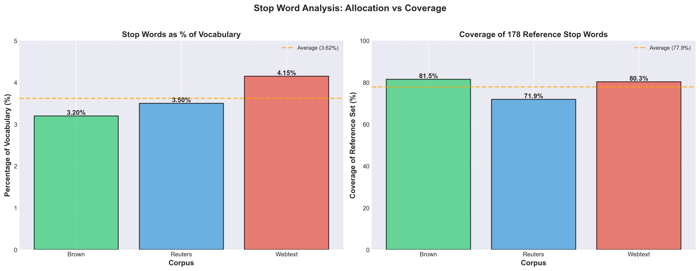

# Stop Word Coverage in SentencePiece Vocabularies: A Comparative Analysis

**Investigating how different text corpora affect stop word representation in learned vocabularies**

---

## Summary

This study investigates the representation and coverage of English stop words across three distinct SentencePiece-trained vocabularies derived from diverse text corpora: Brown (balanced multi-genre), Reuters (financial news), and Webtext (informal web content). Using a reference set of 178 common English stop words, we analyzed both the proportion of vocabulary space allocated to stop words and the coverage of unique stop word forms.

### Key Findings

| Metric | Brown | Reuters | Webtext | Average |
|--------|-------|---------|---------|---------|
| Vocabulary Allocation | 3.20% | 3.50% | 4.15% | 3.62% |
| Stop Word Coverage | 81.5% | 71.9% | 80.3% | 77.9% |
| Unique Stop Words | 145/178 | 128/178 | 143/178 | 139/178 |
| Coverage Rank | 1st | 3rd | 2nd | - |

**Main Finding**: While stop words comprise only 3-4% of vocabulary tokens across all corpora, coverage varies significantly (71.9%-81.5%), reflecting the linguistic diversity of each source corpus. Balanced corpora (Brown) capture 10% more stop words than domain-specific corpora (Reuters), despite identical vocabulary sizes.

---

## Research Questions

This study addresses three primary questions. First, what percentage of vocabulary space is dedicated to stop word tokens in vocabularies trained on different corpora? Second, how many unique stop words from a standard reference set actually appear in each vocabulary? Third, how do different source corpora—specifically balanced multi-genre text, specialized news content, and informal web writing—affect the representation of these functional words?

---

## Background: The Three Corpora

### Brown Corpus

The Brown Corpus was created in 1961 at Brown University by W. Nelson Francis and Henry Kučera, marking a milestone as the first computer-readable general corpus of American English. Designed to be a balanced, representative sample of American English prose, the corpus was carefully constructed to serve as a benchmark for both linguistic research and computational analysis. The corpus contains exactly 1 million words, organized into 500 samples of approximately 2,000 words each, drawn from published materials available in 1961.

The defining characteristic of the Brown Corpus is its balanced genre distribution across 15 distinct categories. These include various forms of fiction (general, mystery, science fiction, and romance), press materials (reportage, editorial, and reviews), as well as religious texts, skills and hobbies writing, popular lore, belles-lettres, learned and academic writing, government documents, and humor. This careful curation ensures that no single category dominates, representing diverse writing styles that span both formal registers (academic papers, legal documents) and informal ones (fiction dialogue, personal narratives). The corpus includes first-person narratives, third-person exposition, and second-person instructions, resulting in high vocabulary diversity through its genre mixing. In NLP research, the Brown Corpus serves as a standard benchmark for corpus linguistics, morphology studies, and historical language analysis, with its balance making it particularly suitable for training general-purpose language models.

### Reuters Corpus

The Reuters Corpus, encompassing both Reuters-21578 and the later RCV1 (Reuters Corpus Volume 1), was compiled from Reuters newswire articles published primarily in the 1990s and 2000s. Created specifically for text categorization research and information retrieval tasks, this corpus focuses heavily on financial and business news. With approximately 10 million words distributed across more than 800,000 documents in the RCV1 version, it represents a substantial collection of professional journalism.

The content is dominated by coverage of financial markets, corporate news, economic reports, business transactions, and merger/acquisition activity, all written with a global scope but limited to English-language publications. As time-sensitive news articles written for immediate publication, the texts exhibit the hallmarks of professional news writing: objective, formal register maintained through third-person factual reporting, with notably limited use of first or second-person pronouns. The domain-specific vocabulary is heavily weighted toward financial and economic terminology such as stocks, bonds, earnings, and GDP. Professional news writing standards result in minimal contractions, while the structured format of headlines, datelines, and body text creates high redundancy in certain phrases like "company said" or "according to." In NLP applications, the Reuters Corpus has become a standard benchmark for text classification tasks, named entity recognition (particularly for organizations and locations), and domain adaptation studies, as it effectively tests model performance on specialized vocabulary.

### Webtext Corpus

The Webtext Corpus represents a sampling of web sources from the 2000s and 2010s, capturing the distinctive linguistic characteristics of informal internet communication that differ markedly from edited prose. Its purpose is to document how people actually write online, where the conventions of formal editing give way to more spontaneous, conversational expression. The corpus varies in size depending on sampling methodology but typically contains millions of words drawn from blogs, forums, discussion boards, comments sections, and other forms of user-generated content. While covering diverse topics, the content maintains a consistently informal register throughout, reflecting the contributions of multiple authors with varying levels of writing ability.

The defining feature of this corpus is its conversational style that mimics spoken language more closely than written text. Writers frequently employ first-person narratives and direct address using "you" and "we," creating an intimate, immediate tone. Contractions appear liberally (don't, can't, I'm), accompanied by colloquialisms, slang, and internet-specific language that would rarely appear in edited publications. The grammatical flexibility extends to sentence fragments and non-standard punctuation, while the overall vocabulary sophistication tends to be lower than in edited text. However, this informality comes with emotional expressiveness, as writers share opinions, anecdotes, and personal experiences freely. In NLP research, Webtext serves as crucial training data for social media analysis, sentiment detection, and conversational AI systems, as it represents contemporary informal English that exists closer to the speech end of the language spectrum than the writing end.

### Comparative Framework

These three corpora form a carefully structured linguistic spectrum. The Brown Corpus serves as a balanced, edited, multi-genre baseline, representing carefully curated written English across diverse contexts. The Reuters Corpus occupies the specialized, formal, single-domain position, demonstrating how professional constraints and subject matter focus shape linguistic patterns. The Webtext Corpus anchors the informal, conversational, multi-author end of the spectrum, showing how unedited, spontaneous communication differs from prepared text. This diversity is particularly valuable for studying functional words like stop words, which behave differently across registers.

---

## Methodology

### Experimental Design

We trained three separate SentencePiece vocabularies, each containing 10,000 tokens, using the unigram language model on text from Brown (~1M words), Reuters (~10M words), and Webtext (variable size) corpora. This fixed vocabulary size allows for direct comparison of how corpus characteristics affect token selection and stop word representation.

Our reference set comprises 178 common English stop words spanning several functional categories. Function words include articles (a, an, the) and prepositions (of, in, at, for, with). Pronouns cover both personal forms (I, you, he, she, it, we, they) and possessive variants (my, your, his, her, its, our, their). Auxiliary verbs encompass be-forms (am, is, are, was, were, been), have-forms (have, has, had), and modals (can, could, will, would, shall, should, may, might, must). The set also includes contractions in both negative forms (don't, can't, won't, shouldn't) and auxiliary combinations (I'm, you're, he's, we've). Common adverbs such as very, just, now, and then complete the reference list.

### Normalization Process

To ensure accurate matching between SentencePiece tokens and our reference stop words, we applied several normalization procedures. We removed the SentencePiece space marker (▁) that indicates word boundaries, normalized all text to lowercase for case-insensitive comparison, and standardized various apostrophe representations (', ', `) to a single form. For words that SentencePiece fragments into subword units, we performed subword matching to identify stop word components.

### Evaluation Metrics

We calculated two complementary metrics. Vocabulary percentage measures the proportion of vocabulary tokens dedicated to stop words, computed as (stop_word_tokens / total_vocab_size) × 100. Coverage percentage assesses how many unique stop words from our reference set appear in each vocabulary, calculated as (unique_matched_stopwords / 178) × 100.

---

## Results

### Vocabulary Allocation

Despite substantial differences in corpus size, domain, and register, stop words consistently occupy 3-4% of vocabulary space across all three corpora. Brown allocated 320 tokens (3.20%) to stop words, Reuters allocated 350 tokens (3.50%), and Webtext allocated 415 tokens (4.15%). This stability suggests that stop words form a functional layer in language that remains relatively constant regardless of domain or genre, consuming vocabulary space proportional to their frequency in natural language rather than being influenced by specific corpus characteristics.

### Coverage Analysis

Coverage varied significantly based on corpus characteristics. Brown achieved the highest coverage at 81.5% (145 of 178 stop words), demonstrating how diverse genres expose the vocabulary to broad linguistic variation. Reuters showed the lowest coverage at 71.9% (128 of 178 stop words), reflecting the restricted register of formal news writing where contractions and informal pronouns rarely appear. Webtext achieved intermediate coverage at 80.3% (143 of 178 stop words), benefiting from its conversational style while still missing archaic or rare forms that don't appear in contemporary web discourse.



The visualization illustrates this dichotomy clearly. The left panel shows similar allocation percentages across all three corpora (3-4% range), while the right panel reveals substantial coverage differences spanning a 10% range (72-82%). This pattern demonstrates that while all corpora dedicate roughly equivalent vocabulary space to stop words, the specific stop words captured vary considerably based on linguistic register and genre diversity.

### Gap Analysis

The 21-28% of uncovered stop words follow predictable patterns related to register and formality. Rare contractions like mightn't, shan't, and needn't represent archaic or highly formal constructions that appear infrequently in modern text. Negative forms such as wasn't, weren't, hasn't, and hadn't often get fragmented by the tokenizer into separate subword units rather than preserved as single tokens. Possessive contractions like you've, I'd, and they're occur less commonly in formal writing but should theoretically appear more in informal contexts like Webtext. Emphatic forms such as that'll and should've primarily characterize spoken language and may not appear frequently enough in written corpora to merit dedicated tokens.

Conversely, 128 stop words appeared universally across all three vocabularies, representing the functional core of English. These include core articles (a, an, the), common prepositions (of, in, to, for, with, at, from, by), basic pronouns (I, you, he, she, it, we, they), essential verbs (is, are, was, were, be, been, have, has, had, do, does, did), and frequent conjunctions (and, but, or, if). This universal set demonstrates the essential functional vocabulary that transcends register and domain.

---

## Discussion

### Corpus-Specific Patterns

The Brown Corpus achieved the highest coverage precisely because its balanced design exposes the vocabulary to multiple linguistic contexts simultaneously. Fiction sections contribute conversational language with frequent contractions, academic texts provide formal pronouns and auxiliary verbs, and news sections bridge formal and informal registers. This genre mixing captures rare but valid stop words that specialized corpora miss, validating the longstanding use of Brown as a general-purpose benchmark. The corpus effectively samples the full spectrum of written English registers within a single dataset.

The Reuters Corpus's restricted register explains its notably lower coverage. Financial journalism adheres to strict professional writing standards that minimize contractions, reduce first and second-person pronouns in favor of objective third-person reporting, and prioritize domain-specific terminology over common functional words. The formal style deliberately avoids colloquialisms and conversational markers. Consequently, Reuters vocabularies systematically exclude stop words like can't, won't, shouldn't, you've, and I'm that appear frequently in less formal registers. This specialization trades linguistic breadth for domain-specific depth, making Reuters vocabularies ideal for financial NLP tasks but less suitable for general language understanding.

The Webtext Corpus presents an interesting intermediate case. Despite its highly conversational style with frequent contractions, first-person narratives, and informal register, it still misses 20% of the reference stop words. This gap likely reflects sampling methodology—web scrapers may not capture all linguistic contexts present online. Regional and dialectal variations in web content may also skew vocabulary toward particular stop word variants. Additionally, archaic forms that appear in historical texts like Brown have been largely excluded from modern web writing, creating temporal gaps in coverage. The corpus effectively captures contemporary informal English but doesn't achieve the comprehensive coverage that Brown's carefully curated genre balance provides.

### Tokenization Dynamics

SentencePiece's subword tokenization creates systematic patterns in stop word representation. High-frequency stop words like "the" remain atomic units (▁the) because their frequency justifies dedicated tokens. Lower-frequency forms undergo fragmentation—for example, "shouldn't" might split into "should" and "n't" because the combination appears less frequently than the components. This frequency-driven behavior inflates the raw token count dedicated to stop words while potentially reducing coverage of unique forms, as evidenced by Webtext's 415 tokens covering only 143 unique stop words compared to Brown's 320 tokens covering 145 unique forms. The tokenizer's statistical approach means that corpus frequency patterns directly determine which stop words receive dedicated tokens versus fragmented representation.

---

## Implications

### Vocabulary Design Considerations

The consistent 3-4% allocation across diverse corpora suggests that reserving 300-400 tokens for stop words suffices for 10,000-token vocabularies, regardless of domain. Stop words consume vocabulary space proportional to their natural frequency without dominating the vocabulary or crowding out content words. This stability implies that models trained on different corpora share similar functional word distributions even when their content vocabularies differ substantially. Vocabulary size planning can therefore use this consistent ratio as a baseline expectation.

### Corpus Selection Strategy

The substantial coverage variation (71.9%-81.5%) has direct implications for corpus selection in NLP applications. Domain-specific corpora like Reuters may lack the conversational stop words needed for general-purpose tasks like dialogue systems or sentiment analysis, where contractions and first-person pronouns carry important semantic and pragmatic information. Balanced corpora like Brown prove more suitable for training general-purpose models that must handle diverse linguistic contexts. Specialized models may require deliberate stop word augmentation to compensate for systematic gaps in their training corpora. The finding that high token counts don't guarantee high coverage—Webtext's 415 tokens covered fewer unique forms than Brown's 320—emphasizes that corpus quality matters more than quantity for functional word representation.

### Application-Specific Concerns

Different NLP tasks face distinct challenges from incomplete stop word coverage. Modern stop word removal approaches must account for fragmented representations, as removing only whole-word matches will miss subword-tokenized variants. Named entity recognition systems may struggle with entity boundary detection when vocabularies lack coverage of determiners and prepositions that signal entity edges. Sentiment analysis faces particular challenges with missing contractions like "can't" and "won't," as these negative forms carry crucial polarity information. Current 10,000-token vocabularies provide approximately 78% stop word coverage, suggesting that larger vocabularies (20,000-50,000 tokens) may approach 90%+ coverage by allowing more low-frequency functional words to receive dedicated tokens.

---

## Limitations

Our analysis focused on 178 stop words, though larger reference lists containing 300-400 words exist in the literature. The reference set emphasizes written English, potentially underrepresenting stop words more common in spoken language or casual speech. We made no distinction between content-bearing and purely functional usage—words like "just" can serve as either temporal markers or intensifiers depending on context. The study examined single snapshots of each corpus type without controlling for training data size variations (1M words for Brown versus 10M for Reuters). Temporal effects remain unexplored, though language evolves continuously and stop word usage changes over time. The fixed 10,000-token vocabulary size may not reflect optimal settings for all applications, and we examined only the unigram language model—other tokenization algorithms like BPE or WordPiece might show different patterns. Character coverage and byte fallback effects were not analyzed despite their potential influence on subword tokenization behavior.

---

## Conclusions

This analysis reveals several key findings about stop word representation in subword vocabularies. First, stop words consistently occupy 3-4% of vocabulary space across diverse corpora, forming a stable functional layer independent of domain or genre. Second, coverage ranges from 72-82%, with balanced corpora significantly outperforming domain-specific corpora in capturing unique stop word forms. Third, source corpus characteristics predict stop word coverage better than tokenization parameters, emphasizing the importance of training data selection. The practical implications are clear: corpus selection should be driven by target application requirements, balanced corpora offer advantages for general-purpose models, and domain-specific models may require deliberate augmentation to achieve adequate functional word coverage.

---

## Future Research Directions

Several avenues warrant further investigation. Vocabulary size scaling studies could reveal how coverage changes with 5,000, 20,000, or 50,000-token vocabularies and whether diminishing returns emerge at certain thresholds. Multilingual analysis would determine whether these patterns generalize across languages or reflect English-specific characteristics. Frequency weighting approaches might provide more nuanced measures than binary presence/absence by incorporating stop word usage frequency into coverage metrics. Downstream task evaluation could establish whether stop word coverage correlates with performance on specific NLP tasks like sentiment analysis, named entity recognition, or machine translation. Temporal dynamics research might track how stop word usage evolves in web corpora over time as language changes and new expressions emerge. Comparative studies of different tokenization algorithms—BPE, WordPiece, and unigram—could identify whether tokenization method influences stop word representation patterns.

---

## References

1. Kudo, T., & Richardson, J. (2018). SentencePiece: A simple and language independent approach to subword tokenization. *Proceedings of EMNLP 2018*, 66-71.

2. Kudo, T. (2018). Subword regularization: Improving neural network translation models with multiple subword candidates. *Proceedings of ACL 2018*, 66-75.

3. Francis, W. N., & Kučera, H. (1979). *Brown Corpus Manual*. Brown University.

4. Lewis, D. D., Yang, Y., Rose, T. G., & Li, F. (2004). RCV1: A new benchmark collection for text categorization research. *Journal of Machine Learning Research*, 5, 361-397.

5. Sennrich, R., Haddow, B., & Birch, A. (2016). Neural machine translation of rare words with subword units. *Proceedings of ACL 2016*, 1715-1725.

---

## Reproducibility

Analysis code available in `demos/analyze_stopwords.py`.

---

## Citation

```bibtex
@article{stopword_coverage_2025,
  title={Stop Word Coverage in SentencePiece Vocabularies: A Comparative Analysis},
  author={Corpus Vocabulary Comparison Project},
  year={2025},
  url={https://github.com/Avielstein/Natural-language-processing}
}
