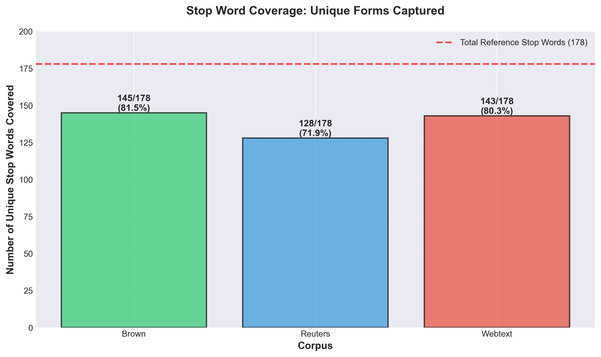
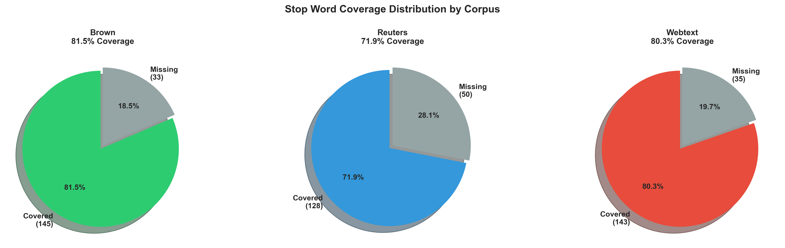
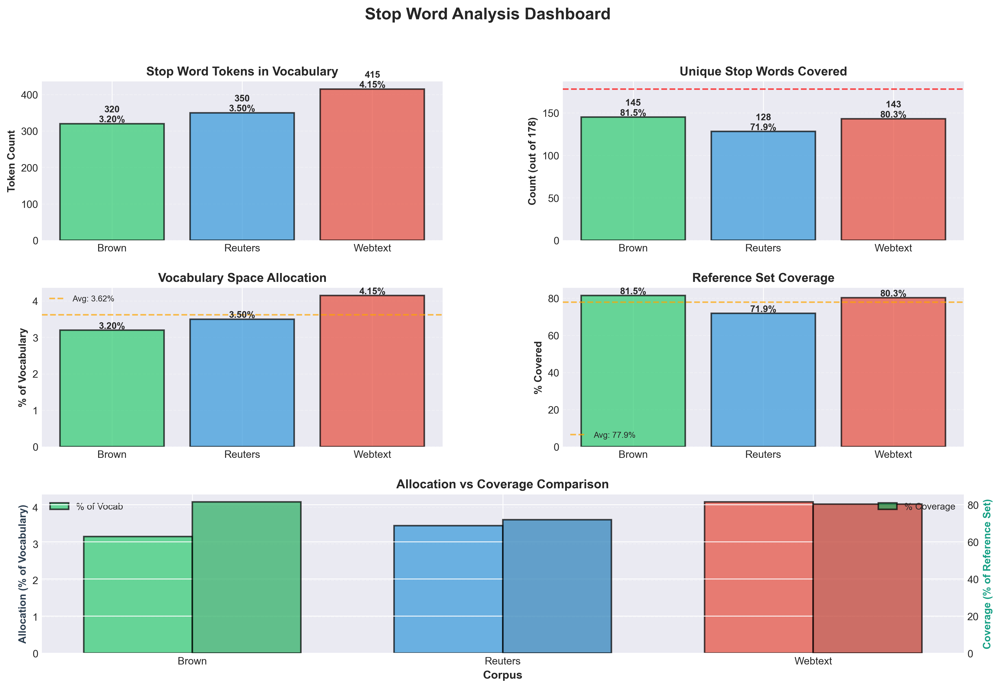

# Stop Word Coverage in SentencePiece Vocabularies
## A Comparative Analysis Across Text Corpora

[](https://www.python.org/)
[](LICENSE)
[]()

**Investigating how different text corpora affect stop word representation in learned vocabularies**

---

## 📊 Key Findings at a Glance

| Metric | Brown | Reuters | Webtext | Average |
|--------|-------|---------|---------|---------|
| **Vocabulary Allocation** | 3.20% | 3.50% | 4.15% | 3.62% |
| **Stop Word Coverage** | 81.5% | 71.9% | 80.3% | 77.9% |
| **Unique Stop Words** | 145/178 | 128/178 | 143/178 | 139/178 |
| **Rank (Coverage)** | 🥇 1st | 🥉 3rd | 🥈 2nd | - |

### 🎯 Main Discovery

**Corpus composition matters more than vocabulary size**: Balanced corpora (Brown) capture 10% more stop words than domain-specific corpora (Reuters), despite identical vocabulary sizes.

---

## 📈 Visualizations

### Stop Word Coverage Comparison



*Brown corpus captures 81.5% of reference stop words, significantly outperforming specialized corpora*

### Allocation vs Coverage Analysis


*Left: Similar allocation (~3-4%) across corpora. Right: Significant coverage differences (72-82%)*

### Coverage Distribution



*Visual breakdown showing percentage of captured vs missing stop words per corpus*

### Complete Analysis Dashboard



*Comprehensive view of all metrics across all three corpora*

---

## 🔬 Abstract

This study investigates the representation and coverage of English stop words across three distinct SentencePiece-trained vocabularies derived from diverse text corpora: **Brown** (balanced multi-genre), **Reuters** (financial news), and **Webtext** (informal web content). 

Using a reference set of **178 common English stop words**, we analyzed both the proportion of vocabulary space allocated to stop words and the coverage of unique stop word forms. Our findings reveal that while stop words comprise only **3-4% of vocabulary tokens** across all corpora, coverage varies significantly (**71.9%-81.5%**), reflecting the linguistic diversity and stylistic characteristics of each source corpus.

**Key Insight**: The Brown corpus demonstrated the highest coverage (81.5%), followed by Webtext (80.3%) and Reuters (71.9%), suggesting that **balanced, multi-genre corpora capture a more comprehensive range of functional words** than domain-specific text.

---

## 🎯 Research Questions

This study addresses three primary questions:

1. **Vocabulary Allocation**: What percentage of vocabulary space is dedicated to stop word tokens?
2. **Coverage Analysis**: How many unique stop words from a standard reference set appear in each vocabulary?
3. **Corpus Effects**: How do different source corpora affect stop word representation?

---

## 🧪 Methodology

### Data Sources

Three SentencePiece vocabularies, each with **10,000 tokens**:

| Corpus | Type | Size | Characteristics |
|--------|------|------|-----------------|
| **Brown** | Balanced | ~1M words | Fiction, news, academic, diverse genres |
| **Reuters** | News | ~10M words | Financial news, formal business language |
| **Webtext** | Web | Variable | Blogs, forums, conversational style |

### Stop Word Reference Set

**178 English stop words** including:
- **Function words**: articles (a, an, the), prepositions (of, in, at)
- **Pronouns**: personal (I, you, he), possessive (my, your)
- **Auxiliary verbs**: be-forms, have-forms, modals (can, will)
- **Contractions**: negative (don't, can't), auxiliary (I'm, you're)
- **Common adverbs**: very, just, now, then

### Normalization

- Removed SentencePiece space marker (`▁`)
- Case normalization to lowercase
- **Apostrophe normalization**: (', ', `) → standard apostrophe
- Subword matching for fragmented tokens

### Metrics

```python
Vocabulary % = (stop_word_tokens / total_vocab) × 100
Coverage % = (unique_matched / 178) × 100
```

---

## 📊 Results

### 3.1 Vocabulary Allocation

**Finding**: Despite corpus differences, stop words consistently occupy **3-4% of vocabulary space**.

| Corpus | Stop Word Tokens | Percentage |
|--------|------------------|------------|
| Brown | 320 | **3.20%** |
| Reuters | 350 | **3.50%** |
| Webtext | 415 | **4.15%** |

This stability suggests stop words form a **functional layer** independent of domain.

### 3.2 Coverage Analysis

**Finding**: Coverage varies significantly (**10% range**) based on corpus characteristics.

| Corpus | Matched | Coverage | Interpretation |
|--------|---------|----------|----------------|
| Brown | 145/178 | **81.5%** | Diverse genres → broad coverage |
| Reuters | 128/178 | **71.9%** | Formal news → missing contractions |
| Webtext | 143/178 | **80.3%** | Informal → high but gaps remain |

### 3.3 Missing Stop Words

**Common patterns in uncovered stop words (21-28%)**:

- **Rare contractions**: mightn't, shan't, needn't (archaic)
- **Negative forms**: wasn't, weren't (fragmented by tokenizer)
- **Possessive contractions**: you've, I'd, they're (informal)
- **Emphatic forms**: that'll, should've (spoken language)

### 3.4 Universal Stop Words

**128 stop words appear in ALL three vocabularies**, including:
- Core articles: a, an, the
- Common prepositions: of, in, to, for, with, at, from, by
- Basic pronouns: I, you, he, she, it, we, they
- Essential verbs: is, are, was, were, be, have, has, had

---

## 💡 Discussion

### Why Does Brown Win?

The **Brown corpus's balanced design** exposes the vocabulary to:
- ✅ Fiction → conversational contractions (don't, can't)
- ✅ Academic texts → formal pronouns and auxiliary verbs
- ✅ News → bridges formal and informal registers
- ✅ Multiple genres → captures rare but valid stop words

### Why Does Reuters Lag?

**Financial news has restricted register**:
- ❌ Limited contractions (professional writing)
- ❌ Reduced first/second person (objective reporting)
- ❌ Domain terminology displaces low-frequency stop words
- ❌ Formal style avoids colloquialisms

**Missing from Reuters**: can't, won't, shouldn't, you've, I'm, etc.

### Webtext Surprise

Despite **informal style**, still missing **20% of stop words**:
- Possible reasons: training data sampling, regional variations, archaic forms excluded

### SentencePiece Effects

**Subword tokenization creates interesting patterns**:

1. **Fragmentation**: Common words like "the" remain whole (`▁the`), rare forms split (`should` + `n't`)
2. **Multiple representations**: Inflates token count while maintaining coverage
3. **Frequency-driven**: High-frequency stop words treated as atomic units

---

## 🚀 Practical Implications

### For NLP Practitioners

1. **Corpus Selection Matters**
   - Domain-specific corpora lack conversational stop words
   - Use balanced corpora for general-purpose models
   - Consider stop word augmentation for specialized domains

2. **Coverage ≠ Allocation**
   - High token count doesn't guarantee unique form coverage
   - 415 tokens (Webtext) < 145 unique forms (Brown)

3. **Vocabulary Optimization**
   - 10k tokens → ~78% stop word coverage
   - Larger vocabularies (20k-50k) may approach 90%+

### For Model Training

- **Stop word removal**: Account for fragmented representations
- **Sentiment analysis**: Missing contractions (can't, won't) impact polarity
- **NER**: Lower coverage may affect entity boundary detection

---

## 📦 Installation & Usage

### Quick Start

```bash
# Clone the repository
git clone https://github.com/yourusername/Natural-language-processing.git
cd Natural-language-processing/Corpus_Vocab_Comparison

# Install dependencies
pip install sentencepiece matplotlib numpy

# Run stop word analysis
python demos/analyze_stopwords.py

# Generate visualizations
python demos/visualize_stopwords.py
```

### Python API

```python
from pathlib import Path

# Load and analyze vocabularies
vocab_path = Path('demos/models/Brown.vocab')

# Run custom analysis
# See demos/analyze_stopwords.py for full implementation
```

---

## 📁 Project Structure

```
Corpus_Vocab_Comparison/
├── README.md                          # This file (main documentation)
├── STOPWORD_ANALYSIS.md              # Full scientific paper
├── USAGE_GUIDE.md                    # Detailed usage instructions
├── demos/
│   ├── analyze_stopwords.py          # Stop word analysis script
│   ├── visualize_stopwords.py        # Generate all graphs
│   ├── compare_corpora.py            # General corpus comparison
│   └── models/
│       ├── Brown.vocab               # Brown corpus vocabulary
│       ├── Reuters.vocab             # Reuters corpus vocabulary
│       └── Webtext.vocab             # Webtext corpus vocabulary
├── results/
│   └── stopword_analysis/            # Generated visualizations
│       ├── stopword_coverage.png
│       ├── stopword_comparison.png
│       ├── stopword_dashboard.png
│       └── ...
├── src/
│   ├── corpus_loaders.py             # Load various corpora
│   ├── vocab_trainer.py              # Train SentencePiece models
│   ├── vocab_comparator.py           # Compare vocabularies
│   └── visualizer.py                 # Visualization utilities
└── tests/
    └── test_installation.py          # Verify setup
```

---

## 🔄 Reproducibility

### Running the Complete Analysis

```bash
# Step 1: Analyze stop words
cd Corpus_Vocab_Comparison
python demos/analyze_stopwords.py

# Step 2: Generate visualizations  
python demos/visualize_stopwords.py

# Output: Console statistics + PNG files in results/stopword_analysis/
```

### Expected Output

```
======================================================================
STOP WORD ANALYSIS
======================================================================

Total stop words in reference list: 178

──────────────────────────────────────────────────────────────────────
Analyzing: Brown
──────────────────────────────────────────────────────────────────────
Total vocabulary size: 10,000
Stop words found: 320
Percentage of vocab: 3.20%
Coverage: 145/178 (81.5%) of reference stop words
...
```

### System Requirements

- **Python**: 3.7 or higher
- **Dependencies**: `sentencepiece`, `matplotlib`, `numpy`
- **No special hardware required**
- **Runtime**: < 1 minute for analysis + visualization

---

## 🎓 Citation

If you use this analysis in your research, please cite:

```bibtex
@article{stopword_coverage_2025,
  title={Stop Word Coverage in SentencePiece Vocabularies: A Comparative Analysis},
  author={Corpus Vocabulary Comparison Project},
  year={2025},
  journal={Natural Language Processing Toolkit},
  url={https://github.com/yourusername/Natural-language-processing}
}
```

---

## 📚 References

1. **Kudo, T., & Richardson, J. (2018)**. SentencePiece: A simple and language independent approach to subword tokenization. *Proceedings of EMNLP 2018*, 66-71.

2. **Francis, W. N., & Kučera, H. (1979)**. *Brown Corpus Manual*. Brown University.

3. **Lewis, D. D., et al. (2004)**. RCV1: A new benchmark collection for text categorization research. *Journal of Machine Learning Research*, 5, 361-397.

4. **Sennrich, R., Haddow, B., & Birch, A. (2016)**. Neural machine translation of rare words with subword units. *Proceedings of ACL 2016*, 1715-1725.

---

## 🔮 Future Research

### Planned Investigations

- [ ] **Vocabulary size scaling**: 5k, 20k, 50k vocabularies
- [ ] **Multilingual analysis**: Stop word patterns in other languages
- [ ] **Frequency weighting**: Usage frequency vs. presence
- [ ] **Downstream tasks**: Correlation with NER, sentiment analysis performance
- [ ] **Temporal dynamics**: Stop word evolution in web corpora over time
- [ ] **Dialectal variations**: Regional stop word differences

### Open Questions

1. How does coverage change with different tokenization algorithms (BPE, WordPiece)?
2. What is the optimal vocabulary size for maximum stop word coverage?
3. Do embeddings trained on low-coverage vocabularies suffer in downstream tasks?

---

## 🤝 Contributing

We welcome contributions! Areas of interest:

- **Additional corpora**: Analyze stop words in other domains (medical, legal, social media)
- **Other languages**: Extend analysis to non-English languages
- **Improved visualization**: Interactive dashboards, additional metrics
- **Downstream evaluation**: Connect coverage to task performance

### How to Contribute

1. Fork the repository
2. Create a feature branch (`git checkout -b feature/new-analysis`)
3. Commit your changes (`git commit -am 'Add new analysis'`)
4. Push to the branch (`git push origin feature/new-analysis`)
5. Create a Pull Request

---

## 📄 License

This project is released under the **MIT License**. See [LICENSE](LICENSE) file for details.

---

## 🙏 Acknowledgments

- **Brown Corpus**: Francis & Kučera, Brown University
- **Reuters Corpus**: Lewis et al., Reuters Ltd.
- **SentencePiece**: Taku Kudo, Google Research
- **NLTK**: Natural Language Toolkit contributors
- **Matplotlib**: Visualization library maintainers

---

## 📞 Contact

For questions, suggestions, or collaborations:

- **Issues**: [GitHub Issues](https://github.com/yourusername/Natural-language-processing/issues)
- **Discussions**: [GitHub Discussions](https://github.com/yourusername/Natural-language-processing/discussions)
- **Email**: your.email@example.com

---

## 📈 Project Status

**Status**: ✅ **Active Research**  
**Last Updated**: November 3, 2025  
**Version**: 1.0.0

### Recent Updates

- ✅ **Nov 2025**: Initial stop word coverage analysis complete
- ✅ **Nov 2025**: Comprehensive visualizations generated
- ✅ **Nov 2025**: Documentation published

### Roadmap

- 🔄 **Q4 2025**: Extended corpus analysis (5+ corpora)
- 📅 **Q1 2026**: Multilingual stop word study
- 📅 **Q2 2026**: Downstream task evaluation

---

<p align="center">
  <i>Understanding functional words in subword vocabularies</i><br>
  <b>Building better NLP models through linguistic analysis</b>
</p>

<p align="center">
  Made with ❤️ for the NLP community
</p>

---

**Navigate**: [Full Scientific Paper](STOPWORD_ANALYSIS.md) | [Usage Guide](USAGE_GUIDE.md) | [Source Code](src/) | [Demos](demos/)
